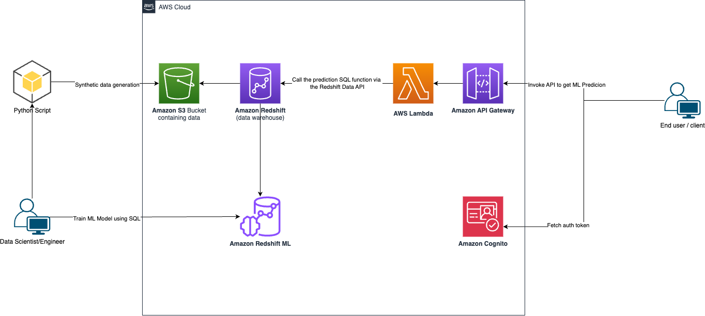
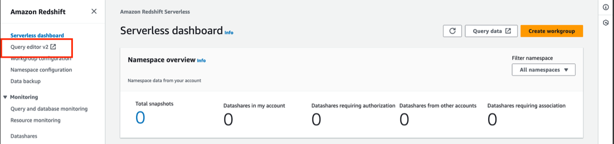
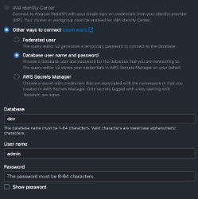
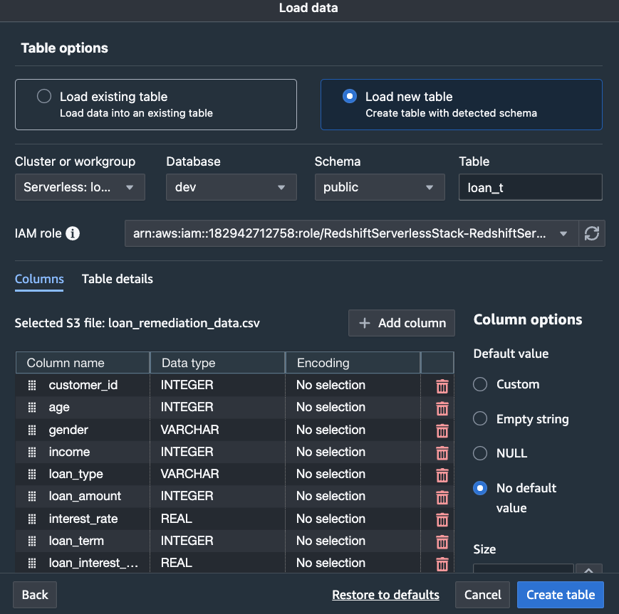
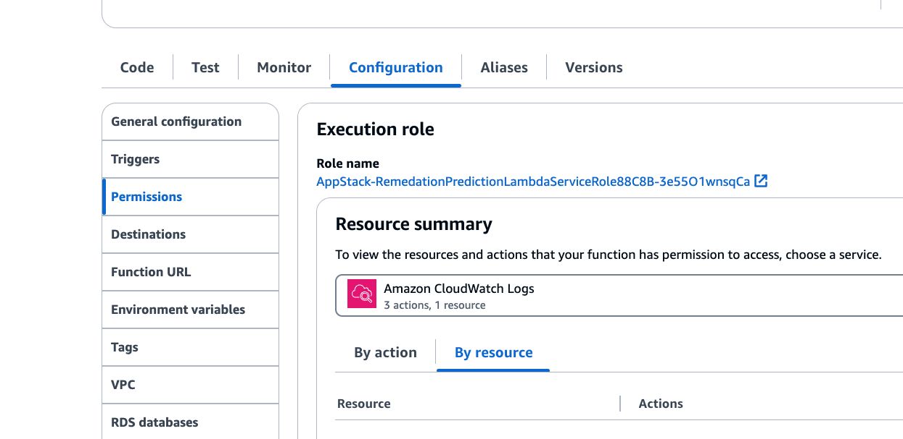
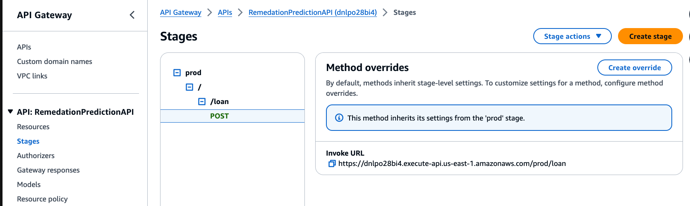

# Prediction App with Amazon Redshift ML and API Gateway

This sample shows how to leverage [Amazon Redshift](https://aws.amazon.com/redshift/) to implement a machine learning model.

This sample will leverage the [serverless](https://aws.amazon.com/redshift/redshift-serverless/) flavor of Amazon Redshift.

It uses [Amazon Redshift ML](https://aws.amazon.com/redshift/features/redshift-ml/) to achieve this. The idea is that you can use simple [SQL](https://aws.amazon.com/what-is/sql/) commands to create a model based on a dataset; and help achieve predictive analytics.

Additionally, it serves the generated machine learning model via an API Endpoint, which is implemented using [Amazon API Gateway](https://aws.amazon.com/api-gateway/) and [AWS Lambda](https://aws.amazon.com/api-gateway/).

The API Layer is protected by an authorization layer provided by [Amazon Cognito](https://aws.amazon.com/cognito/). Lastly, it shows how to use [AWS Web Application Firewall (WAF)](https://aws.amazon.com/waf/) to prevent attacks such as [bot attacks](https://www.cloudflare.com/en-gb/learning/bots/what-is-a-bot-attack/), [DDoS](https://www.cloudflare.com/en-gb/learning/ddos/what-is-a-ddos-attack/) etc.

## Architecture




## Use case / domain 

The use case in this sample is for a lending bank - wanting to optimize their communication strategies for their customers who may be on the verge of defaulting on their loan payments.

We assume the existence of a combined dataset that contains historical information about customers, their demographics, type of loan offered, a remediation strategy that was applied - and the outcome of that strategy - ie. whether the remediation strategy help the customer stop defaulting on their loan payments.

And we apply Amazon Redshift ML on this dataset to get prediction on particular strategies being effective or not for future potential defaulters.

## Synthetic data

The synthetic dataset is in the form of a [csv](./synthetic-dataset/loan_remediation_data.csv) file in the [synthetic-dataset](./synthetic-dataset/) directory. This script uses the [faker](https://faker.readthedocs.io/en/master/) library to generate the synthetic data, and [pandas](https://pandas.pydata.org/) library to create the csv.

It was generated using a [Python script](./scripts/dataset-generation/raw_data.py) which can be found in the [scripts/dataset-generation](./scripts/dataset-generation/) directory.

To modify the generated dataset generation (or generate it again), you can run the script:
```
# change into the script directory
cd scripts/dataset-generation

# create a virtual environment (if not already done)
python3 -m venv .venv

# activate the virtual environment 
source .venv/bin/activate 
# for other shells like the fish shell, you can add ".fish" at the end of the above command

# install the dependencies
pip install -r requirements.txt

# run the script
python raw_data.py
```
Note - it generates the file in the same directory as the script is located instead of the [synthetic-dataset](./synthetic-dataset/) directory.

## Deploying the solution

### Pre-requisites

* Since this is a [TypeScript](https://www.typescriptlang.org/) CDK project, you should have [npm](https://www.npmjs.com/) installed (which is the package manager for TypeScript/JavaScript).
    * You can find installation instructions for npm [here](https://docs.npmjs.com/downloading-and-installing-node-js-and-npm).

* Additionally, it would be required for your to have [AWS CLI](https://aws.amazon.com/cli/) installed on your computer.
    *  `pip install awscli`. This means need to have python installed on your computer (if it is not already installed.)
    * You need to also configure and authenticate your AWS CLI to be able to interact with AWS programmatically. Detailed instructions of how you could do that are provided [here](https://docs.aws.amazon.com/cli/latest/userguide/cli-chap-configure.html)

### Install dependencies (if not already done)

```
npm install
```

### Bootstrap CDK environment (if not already done)

Bootstrapping provisions resources in your environment such as an Amazon Simple Storage Service (Amazon S3) bucket for storing files and AWS Identity and Access Management (IAM) roles that grant permissions needed to perform deployments. These resources get provisioned in an AWS CloudFormation stack, called the bootstrap stack. It is usually named CDKToolkit. Like any AWS CloudFormation stack, it will appear in the AWS CloudFormation console of your environment once it has been deployed. More details can be found [here](https://docs.aws.amazon.com/cdk/v2/guide/bootstrapping.html).

```
npx cdk bootstrap

# You can optionally specify `--profile` at the end of that command if you wish to not use the default AWS profile.
```

### Set the environment variable for REDSHIFT_TABLE_NAME
This environment variable should be the same as the table you will create in the Redshift Query Editor (after the infrastructure is deployed). This is the dataset on which the Machine learning model is trained.
```
export REDSHIFT_TABLE_NAME=public.<enter_the_name_for_your_redshift_table>
```

Note - we are expecting to create this table in the "public" schema of Redshift's dev database. You can have it in any other schema, but you will have to modify the permissions and code in the Lambda function accordingly.

### Deploy the infrastructure

* Deploy base infrastructure - this will deploy the VPC, and security group for Redshift Serverless. Additionally, it creates an Amazon S3 bucket, and uploads the synthetic data to this bucket using the [S3 Bucket Deployment CDK construct](https://docs.aws.amazon.com/cdk/api/v2/docs/aws-cdk-lib.aws_s3_deployment.BucketDeployment.html). If you wish to modify the CIDR block for the VPC, you can do so in the [lib/base-infra-stack.ts](./lib/base-infra-stack.ts#L26)
  ```
  npx cdk deploy BaseInfraStack
  
  # You can optionally specify `--profile` at the end of that command if you wish to not use the default AWS profile.
  ```

* Deploy the Redshift Serverless stack - this deploys the Redshift serverless [namespace and workgroup](https://docs.aws.amazon.com/redshift/latest/mgmt/serverless-workgroup-namespace.html) alongwith the [Secrets Manager](https://aws.amazon.com/secrets-manager/) secret for the root user of the database.
  ```
  npx cdk deploy RedshiftServerlessStack
    
  # You can optionally specify `--profile` at the end of that command if you wish to not use the default AWS profile.
  ```
  Note - if you want to override the default Redshift Serverless Default Database, Namespace and Workgroup names, you can specify these environment variables: `REDSHIFT_DB_NAME`, `REDSHIFT_SERVERLESS_NAMESPACE`, and `REDSHIFT_SERVERLESS_WORKGROUP` respectively.

* Deploy the App stack - this will deploy the Lambda function, API Gateway, and Cognito bits. 
  ```
  npx cdk deploy AppStack
    
  # You can optionally specify `--profile` at the end of that command if you wish to not use the default AWS profile.
  ```

* Deploy the WAF Stack - this will deploy the Web Application Firewall with some pre-configured rules.
  ```
  npx cdk deploy WAFStack
    
  # You can optionally specify `--profile` at the end of that command if you wish to not use the default AWS profile.
  ```


### Setting up the Data and ML Model
After the Redshift Serverless Stack has been successfully deployed, you can follow these steps to load the data and set up the machine learning model:

* Sign into the AWS Console, then search for “Redshift” in the search bar, and select “Query editor v2” on the left hand pane. 

It will open the editor in a new tab in your web browser. On the left hand pane in the editor, you should see all the Redshift serverless Workgroups and/or Provisioned clusters that have been deployed in that specific AWS Region.
* Set up the connection details for the workgroup that you deployed:

  
  
  There are a few different ways to authenticate – a Federated user, Database user and password, or AWS Secrets Manager. For simplicity you can use the details from the Secret that was created as part of the creation of the Redshift Serverless stack.

* Load the synthetic data in a table using the "Load Data" option in the left pane of the Query Editor. Select the option to "Load from S3 bucket", and select the bucket that was created with the Base Infra Stack, and then select the csv file when you browse S3.

* When you keep hitting next, it will ask for Table Options, select "Load new table", which will create a new table with a detected schema. Select the schema under the "Schema" drop down; and under the "Table" section, specify the name of the table. NOTE - this table name must be same as the "REDSHIFT_TABLE_NAME" environment variable that you set in the beginning. For instance if REDSHIFT_TABLE_NAME is "public.loan_t", the schema you should select is "public"; and under table you should enter "loan_t". Lastly, choose the IAM role that comes under the dropdown, and then hit Create Table.

  

* Once it finishes, it will show a message saying the table was created successfully. The following menu will ask you to load the data; click the "Load Data" button. It should then load the data from the CSV into the table. You can verify by running `SELECT * FROM <table name> LIMIT 10;` in the editor. If it returns data, that means data has been loaded successfully.

* Run the following SQL to create the machine learning model on the query editor:

  ```
  CREATE MODEL public.predict_model
  FROM
      (
        SELECT age, gender, income, loan_type, loan_amount, interest_rate, loan_term, loan_interest_rate, credit_score, 
        employment_status, marital_status, remediation_strategy, missed_payments, missed_payments_duration, successful
        FROM <redshift table name environment variable set at the beginning>
        WHERE timestamp < '2023-01-31'
      )
  TARGET successful FUNCTION ml_fn_prediction
  IAM_ROLE default SETTINGS (
    S3_BUCKET '<Name of the S3 bucket>'
  );
  ```

  NOTE:
  * You need to create an S3 bucket where the artifacts would get uploaded - and that is the S3_BUCKET parameter in the SETTINGS (referring to the query above).
  * Make sure that the table name (FROM) is exactly the same as the REDSHIFT_TABLE_NAME environment variable that was set before you started deploying the solution.
  * It takes a few hours for the model to finish creating. It uses [Amazon SageMaker AutoML](https://aws.amazon.com/sagemaker/autopilot/) under the hood.
  * If you change the function name in the query above, make sure to set the environment variable "PREDICTION_FUNCTION_NAME", and re-deploy the AppStack
    ```
    export PREDICTION_FUNCTION_NAME=<some other function name>

    npx cdk deploy AppStack
    ``` 
  * You could see the model via simple SQL commands as well.
  * To list all models: `SHOW MODEL ALL;`
  * To show your model: `SHOW MODEL predict_model;`. This would show details such as Model Name, Schema Name, Owner, Creation Time, Model State, f1 score, Estimated Cost and so on. The key thing here is “Model State”, when it says it is “READY” – that would mean that the model is ready to make predictions. 
  * To get a more detailed analysis/explanation of the model that was created, you can run the “EXPLAIN_MODEL” command: `SELECT EXPLAIN_MODEL('predict_model');`. It will spit out a JSON like object with the [SHAP values](https://www.kaggle.com/code/dansbecker/shap-values) for the different feature columns in the dataset.
  * In case the processing job did not finish and the maximum runtime reached, you may see an error like this:
    ```
    {
        "explanations": "Processing job failed: Maximum runtime reached and processing job is unfinished. Increase MAX_RUNTIME for explanabilty report."
    }   
    ```
    To fix this error, you'll have to set a higher MAX_RUNTIME under the SETTINGS object in the create model query. Full reference can be found on the [AWS Documentation](https://docs.aws.amazon.com/redshift/latest/dg/r_CREATE_MODEL.html).

### Try to test the Lambda function in the console

Navigate to the Lambda service in the AWS console, find out the function by searching for "AppStack", that should pull up the prediction lambda funtion. Click into it. There will be an option to test the function. It will ask you to create a test event. For this, you can copy the contents of the [test-request-body.json](./test-request-body.json) file, and paste it in the event.

After you save the event, hit test, and you should receive an error, that looks something like:
```
{
  "errorMessage": "Query failed: ERROR: permission denied for function or procedure ml_fn_prediction",
  "errorType": "Exception",
  "requestId": "8e7509a7-26c2-491d-85b3-3e3135cc3b9a",
  "stackTrace": [
    "  File \"/var/task/remedation_prediction.py\", line 59, in lambda_handler\n    raise Exception(f\"Query failed: {redshift_data.describe_statement(Id=response['Id'])['Error']}\")\n"
  ]
}
```

Don't worry, this is expected, follow the steps below to Grant the necessary database permissions to the IAM role of the lambda function.

### Grant Permissions for Lambda IAM Role

 To enable the Lambda function to execute the prediction query, you need to grant the necessary database access permissions to the IAM role associated with the Lambda function. 
 
 Open the Amazon Redshift Query Editor and follow these commands:

```
# Replace <lambda-role-name> with the name of the IAM role assigned to your Lambda function; and <redshift-table-name> with the value of the REDSHIFT_TABLE_NAME environment variable you set before deploying the solution.

CREATE ROLE lambda_role;
GRANT EXECUTE ON MODEL public.predict_model TO ROLE lambda_role;
GRANT ALL PRIVILEGES ON TABLE <redshift-table-name> TO ROLE lambda_role;
GRANT ROLE lambda_role TO "IAMR:<lambda-role-name>";

```

To find out what the lambda role name is, find the prediction lambda function, click into it, then click on "Configuration", and select "Permissions" on the left pane. Under "Execution role", you should be able to see the role name.



You can now attempt to test the function in the console again, and should not see that error anymore.

## Testing the API end-to-end

* To test the API, you need to first obtain an authorization token from Amazon Cognito User Pools. 
  * To do this, you can use [Postman](https://www.postman.com/). Note that you will need to create a user in the user pool first. More details on how to create the user can be found [here](https://docs.aws.amazon.com/cognito/latest/developerguide/how-to-create-user-accounts.html). Once you've successfully created a user in the User Pool, you can continue with the rest of the [Postman instructions](#obtain-an-id-token-via-postman).

  * Alternatively, you can use this [open-source utility](https://github.com/aws-samples/cognito-user-token-helper/tree/main) to programmatically create users and generate auth tokens for those users in the Cognito User Pool. 

  #### Obtain an ID token via [Postman](https://www.postman.com/)

  * Create a new user in the Cognito user pool in the Cognito console
  * Navigate to the "App integration" section of the Cognito User Pool and note down the "App client ID"
  * Open Postman and go to the "Authorization" tab. Select the "OAuth 2.0" option as the authentication type. In the "Configure New Token" dialog, provide the following information:
      * Grant Type: Authorization Code
      * Callback URL: https://example.com 
      * Auth URL: https://remedation-app.auth.<AWS_REGION>.amazoncognito.com/oauth2/authorize
      * Access Token URL: https://remedation-app.auth.<AWS_REGION>.amazoncognito.com/oauth2/token
      * Client ID: <app-client-id> (replace with the App Client ID obtained above)
      * Scope: openid
  * Click on the "Get New Access Token" button in Postman. The Cognito Hosted UI will appear, prompting you to sign in with the user created in step 1. If prompted, reset your password as per the instructions. After successful sign-in, Postman will display the access token and ID token. Copy the ID token for use in your API requests

  #### Test the authorized API endpoint

  Once the token is obtained, you can now send a request to the API. You can do it a few different ways:
  
  * Via Postman:
    The endpoint is a `Post` request on the `<ENDPOINT_URL>` route. The invocation URL for the API can be found in the API Gateway console (specifically in the Stages section). IIn Postman, switch to the "Headers" tab. Add a new header with the key `Authorization` and the value <ID_TOKEN>.  Provide the [Sample Request Body](./test-request-body.json) in raw format.

  * Via the command line using tools like [cURL](https://curl.se/) and/or [HTTPie](https://httpie.io/) etc. Example shown below is with HTTPie:
    ```
     cat test-request-body.json | http "<ENDPOINT_URL>" "Authorization: Bearer <generated-auth-token>"
    ```
Note - you can locate the ENDPOINT_URL by going to the API Gateway service in the AWS Console, finding the API (should be named on the lines of "PredictionAPI"). If you click on Stages on the left pane, and expand till "/loan", you can copy the invoke (endpoint) URL.




## Generic CDK instructions

This is a blank project for CDK development with TypeScript.

The `cdk.json` file tells the CDK Toolkit how to execute your app.

## Useful commands

* `npm run build`   compile typescript to js
* `npm run watch`   watch for changes and compile
* `npm run test`    perform the jest unit tests
* `cdk deploy`      deploy this stack to your default AWS account/region
* `cdk diff`        compare deployed stack with current state
* `cdk synth`       emits the synthesized CloudFormation template